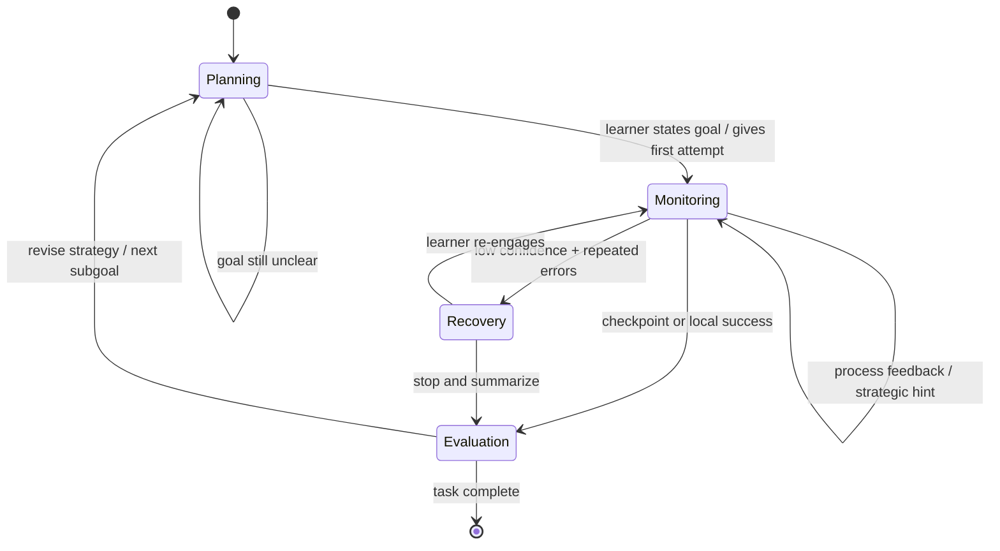
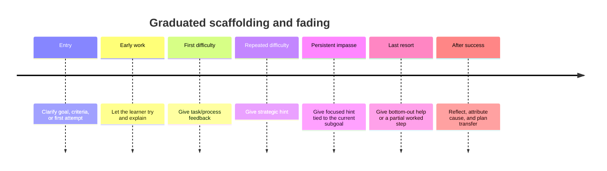

# Research Base for a Deterministic Policy Engine for Milo

## Executive Summary

The most defensible research foundation for Milo’s Policy Engine is a synthesis of metacognition, self-regulated learning, scaffolding, and tutorial dialogue research. Across these traditions, the same structural pattern appears repeatedly: learners first form a task understanding and plan, then monitor and control performance while working, and finally evaluate outcomes and adapt future strategy. For engineering purposes, that strongly supports implementing the Policy Engine as a deterministic state machine with at least three macro-states—**PLANNING**, **MONITORING**, and **EVALUATION**—plus explicit transitions driven by observable signals rather than a free-form “chat style” controller. citeturn11view1turn23view5turn23view2turn32search7

The literature does **not** support a policy that begins by giving answers. Classic scaffolding work defines support as contingent, calibrated assistance that reduces difficulty, keeps attention on the task, highlights critical features, controls frustration, and then fades as competence rises. Later work on computer-based scaffolds sharpens this into four design principles: **diagnosis, calibrated support, fading, and individualization**. In practical terms, Milo should usually start with clarification, self-explanation, elaborative questioning, or strategic hints, and reserve direct-answer behavior for a late-stage “bottom-out” condition after repeated unproductive struggle or explicit pedagogical override. citeturn15view0turn15view2turn15view3turn15view4turn14view4turn13view6turn13view7turn31view0

The strongest questioning results point in the same direction. Student learning is associated more with the **quality** of questions than with their mere frequency; teaching learners to generate questions yields positive comprehension gains; prompted self-explanation improves deeper understanding and mental models; and requiring learners to justify their solution steps improves transfer and performance on harder items. That means Milo’s policy should prefer prompts such as “What is your goal?”, “Why does that step make sense?”, “What would you try next?”, and “What evidence supports that?” over generic comprehension checks or direct completion of the learner’s work. citeturn17view0turn17view1turn17view2turn21view3turn22view2turn22view3

The feedback literature also converges on a clear implementation rule: feedback is strongest when it targets the **task**, the **process**, or the learner’s **self-regulation**, and weakest when it collapses into generic praise at the self level. Feedback timing is not one-size-fits-all; immediate feedback tends to help more on difficult tasks, whereas delayed feedback can be preferable on easier tasks or where transfer is the goal. For an interactive tutor, the best default is not “right/wrong + answer,” but an **informative tutoring feedback** ladder: brief verification, then process cue, then strategic hint, then focused hint, then bottom-out help if needed. citeturn13view0turn13view1turn13view2turn13view3turn13view4turn13view5turn31view0

For personalization, the most realistic starting point is a small set of simple, testable signals: confidence self-ratings, response time relative to task/user baseline, repeated wrong or inefficient attempts, hint abuse, help avoidance, and confusion/frustration cues. Research in intelligent tutoring shows that unproductive help-seeking is common, rapid hint-clicking is associated with shallow engagement, random proactive hints can harm performance, and need-based hinting works better than indiscriminate hinting. At the same time, confidence alone is an imperfect guide on higher-order tasks, so Milo should combine self-report with trace data instead of over-trusting either one. citeturn29search0turn31view0turn30view0turn30view2turn30view4turn13view9turn13view10turn25view3turn25view4turn25view5turn25view6

The result is a clear design target: Milo’s Policy Engine should be a **rule-based orchestration layer** that selects metacognitive moves, gates answer directness, escalates hints gradually, rate-limits interventions, and logs traces that can later be used for evaluation. The right validation strategy is not only user satisfaction, but measured change in explanation quality, transfer, calibration, help-seeking behavior, and safety outcomes such as direct-answer leakage or over-intervention. citeturn23view3turn17view3turn22view3turn30view1

## Foundational Models and Seminal Results

Metacognition is classically defined as knowledge about and regulation of one’s cognition. Subsequent self-regulated learning models broaden that into a cycle that includes goals, plans, strategic action, monitoring, and adaptation. For Milo, the key point is that the major traditions are compatible enough to justify a compact implementation model: **planning/forethought**, **monitoring/performance control**, and **evaluation/adaptation**. That is a simplification, but it is a research-aligned simplification rather than an arbitrary one. citeturn11view1turn23view5turn23view2turn32search7

One especially useful engineering contribution from the SRL literature is the insistence on **observable traces**. Winne and Hadwin argue that studying produces traces such as notes, self-generated questions, diagrams, revisions, and attempts, and they recommend using trace data as a standard feature for understanding metacognitive monitoring and control. This is highly relevant to a Policy Engine because it argues against relying only on the text of a single turn. Response latency, revision behavior, repeated attempts, hint requests, and changes in confidence should all be first-class inputs. citeturn23view1turn23view2turn23view3

A second crucial implication comes from feedback theory. Butler and Winne treat feedback not as an optional add-on after learning, but as a constituent part of self-regulated learning itself. Hattie and Timperley similarly frame effective feedback around three questions—**Where am I going? How am I going? Where to next?**—and distinguish task, process, self-regulation, and self-level feedback. For Milo, this means the policy layer should explicitly encode which of those questions it is answering at each step, and it should avoid defaulting to praise-only or answer-only responses. citeturn32search7turn13view1turn13view2

The tutoring literature fills in the interactional detail. Wood, Bruner, and Ross’s classic scaffolding paper describes six core tutor functions: recruitment, reduction in degrees of freedom, direction maintenance, marking critical features, frustration control, and demonstration. Later ITS work from Koedinger, Aleven, Graesser, and VanLehn shows how those functions can be operationalized in step-based or dialogue-based tutors through calibrated prompts, strategy support, and graduated hints. Taken together, these works imply that Milo’s Policy Engine should decide **how much help** to give, **when** to give it, and **in what form**, not merely which prompt template to select. citeturn15view0turn15view2turn15view3turn15view4turn17view3turn24search9turn13view7

| Source | Core claim | Direct implication for Milo |
|---|---|---|
| Flavell, 1979 | Metacognition concerns knowledge about cognition and regulation/monitoring of cognition. | Maintain explicit slots for task understanding, strategy knowledge, and monitoring judgments. |
| Zimmerman, 2002 | SRL is cyclical: forethought, performance, self-reflection. | Use macro-states that cycle, rather than a single monolithic “tutoring mode.” |
| Winne & Hadwin, 1998 | Studying has four linked stages: task definition, goals/planning, enactment, adaptation; traces matter. | Log traces and use them in transitions and personalization. |
| Butler & Winne, 1995 | Feedback is inherent in SRL. | Treat policy selection and feedback selection as the same control problem. |
| Wood, Bruner, & Ross, 1976 | Scaffolding is contingent help that simplifies, guides, highlights, and fades. | Encode a hint ladder and frustration-aware intervention rules. |
| Chi et al., 1989; 1994 | Self-explanation improves understanding, especially when it leads learners to integrate and infer. | Prefer explanation prompts after attempts, not only correctness checks. |
| Graesser & Person, 1994 | Question quality predicts achievement better than frequency. | Optimize for diagnostic and generative question quality. |
| Hattie & Timperley, 2007 | Task/process/self-regulation feedback is stronger than self-level praise. | Make praise secondary and attach it to actionable feedback. |
| Shute, 2008; Narciss, 2008 | Feedback effectiveness depends on task, learner, and presentation; do not give the correct answer too early. | Use contingent timing and informative tutoring feedback. |
| VanLehn, 2011; Koedinger & Aleven, 2007 | Step-based tutoring and carefully controlled assistance can approach strong tutoring effects, but assistance must be balanced. | Build deliberate escalation and anti-overhelp rules. |

The table synthesizes the primary sources most directly relevant to a deterministic policy layer. citeturn10search1turn11view1turn23view5turn23view2turn32search7turn15view0turn21view3turn17view1turn13view1turn8view3turn31view0turn24search9turn13view7

## What the Applied Tutoring Literature Says About Questions and Timing

The applied questioning literature supports a tutoring style that is **indirect but cognitively demanding**. Graesser and Person found that student questions in tutoring were far more frequent than in classrooms, but more importantly, **achievement correlated with the quality of student questions after learners had some tutoring experience**, whereas question frequency alone did not. This validates a Policy Engine that tries to provoke **better questions and better explanations**, not simply more conversation. citeturn17view0turn17view1

Question-generation training also has reliable benefits. Rosenshine, Meister, and Chapman’s review found that teaching students to generate questions produced comprehension gains, with a median effect size of 0.36 on standardized tests and 0.86 on experimenter-developed comprehension tests. That is strong support for question families that ask the learner to generate a relation, reason, comparison, prediction, or testable next step. citeturn17view2

Self-explanation and elaborative interrogation sharpen this further. Chi and colleagues showed that explicitly prompting self-explanations led to larger pre-post gains and better mental models, and high explainers outperformed low explainers on deeper understanding measures. Elaborative interrogation studies similarly found that asking learners to generate a reason why a fact is true improves memory over passive reading. For Milo, this suggests that after a learner attempts something, the next best move is often an explanation prompt such as “Why would that step be true?” or “What principle made you choose that?” rather than a correction. citeturn21view3turn21view1

The AutoTutor line of work gives a useful dialogue template. Naturalistic tutoring often follows a five-step frame: tutor asks a question or presents a problem, learner responds, tutor gives short immediate feedback, tutor and learner collaboratively improve the response, and only then the tutor assesses understanding. Graesser’s group argues that the advantage of tutoring over classroom IRE patterns lies especially in the multi-turn collaborative improvement step. For Milo, one immediate rule follows: avoid ending a turn after a simple correctness judgment when the learner’s answer can be further elaborated. citeturn17view3turn9view6

A second AutoTutor finding is especially important for policy design: asking “Do you understand?” is a poor assessment move. In naturalistic tutoring, most students answer “yes” even when understanding is vague, incomplete, or wrong; the better students are more likely to say “no.” A Policy Engine should therefore prefer **diagnostic follow-ups** like “What rule would justify that?” or “What would your next step be, and why?” over generic comprehension checks. citeturn17view3

| Question family | What it elicits | Best timing | Example stems for Milo | Main caution |
|---|---|---|---|---|
| Goal-clarification | Task representation and success criteria | Start of task or after drift | “What are you trying to figure out?” / “What would count as a good answer here?” | Too abstract if the learner has not yet read the problem. |
| Strategy-selection | Planning and conditional knowledge | Before first attempt or after failure | “What strategy seems most promising?” / “Which rule or idea might help first?” | Avoid when the learner needs affective stabilization first. |
| Self-explanation | Principle-based reasoning | After an attempt or partial answer | “Why does that step make sense?” / “What assumption are you using?” | Weak if asked before the learner has generated any content. |
| Elaborative interrogation | Integration with prior knowledge | After encountering a fact, claim, or step | “Why would that be true?” / “How does that connect to what you already know?” | Can overload novices if content is too unfamiliar. |
| Error diagnosis | Monitoring and discrepancy detection | After a wrong or shaky attempt | “Where might the mismatch be?” / “Which part are you least certain about?” | Avoid accusatory phrasing. |
| Contrast or counterexample | Boundary conditions and transfer | After a plausible but shallow answer | “When would this not work?” / “Can you think of a counterexample?” | Use sparingly with low-confidence learners. |
| Transfer/generalization | Far transfer and abstraction | After local success | “How would this change in a new case?” / “What general rule are you taking away?” | Too early use can derail local mastery. |
| Calibration | Metacognitive monitoring | At checkpoints | “How sure are you, and what makes you think that?” | Confidence alone is an imperfect proxy for correctness. |
| Reflection/attribution | Adaptation for future tasks | End of task | “What worked?” / “What would you do differently next time?” | Avoid turning reflection into generic praise. |

This table is a design synthesis grounded in tutoring, self-explanation, and question-generation studies. citeturn17view0turn17view2turn21view3turn21view1turn17view3

## Feedback, Hinting, and Adaptive Scaffolding

A strong Policy Engine should distinguish **feedback content** from **feedback timing**. Hattie and Timperley argue that effective feedback answers three questions—Where am I going, How am I going, and Where to next—and works at four levels: task, process, self-regulation, and self. Their key practical result is that task, process, and self-regulation feedback are generally more useful than self-level comments, and self-level praise often dilutes instructional value unless tied to actionable task information. Milo should therefore treat praise as optional seasoning, not the main pedagogical move. citeturn13view0turn13view1turn13view2

Timing is more conditional than many product teams assume. Shute’s review concludes that there is no stable overall winner between immediate and delayed feedback; effects depend on interactions with task difficulty and learner capability. One recurring pattern is that immediate feedback helps more on difficult tasks, while delayed feedback can be preferable on easier tasks and may reduce overreliance. In policy terms, Milo should not hard-code a universal “always immediately intervene” rule. A better default is: intervene quickly for difficult or stall-prone work, but preserve productive struggle when the learner is progressing. citeturn13view3turn13view4

Narciss’s framework is especially helpful for deterministic implementation because it treats feedback as regulation in a loop. It explicitly distinguishes internal signals such as **confidence in answers** and **perceived effort** from external instructional feedback, and it defines **informative tutoring feedback** as elaborated guidance that helps the learner complete the task **without immediately giving the correct response**. That is almost a direct formal specification for Milo’s “no direct answer first” behavior. It also implies that the engine should store not only correctness but internal-state proxies and task complexity. citeturn31view0

Koedinger and Aleven’s “assistance dilemma” gives the clearest rationale for a hint ladder. Too little help leads to unproductive struggle; too much help undermines learning. Their description of cognitive tutor hints is concrete: multiple hint levels become progressively more specific, and the final **bottom-out hint** effectively states the next step or near-answer. Milo should borrow that exact pattern. In other words, teacherly completion of the task should be a **late** policy action, not a first-line response. citeturn13view6turn13view7

Help-seeking studies show why the ladder should be paired with meta-rules. Aleven and colleagues found that 72% of actions in one dataset reflected unproductive help-seeking behavior, including hint abuse, help avoidance, and rapid, underdeliberated actions. They also warn that a tutor that intervenes on three out of four actions would become annoying and distracting. This is a strong argument for **cooldown rules** in Milo: detect problematic help behavior, but do not comment on every single one. citeturn30view0turn30view1turn30view2

Adaptive scaffolding studies strengthen that point. Azevedo and Hadwin argue that scaffolds should be diagnosed, calibrated, individualized, and faded; Molenaar’s work suggests that dynamic metacognitive scaffolds can improve metacognitive knowledge, with problematizing scaffolds often outperforming more directive structuring scaffolds for some outcomes. More recent proactive-hint work shows that need-based hints can reduce far-off and opportunistic errors, while too many randomly timed proactive hints can hurt performance. For Milo, the practical message is clear: intervene **because a signal pattern justifies it**, not because a fixed turn count says so. citeturn14view4turn14view3turn14view2turn13view10turn25view3

| Feedback or hint type | Research-backed role | Recommended use in Milo | Avoid or limit when |
|---|---|---|---|
| Verification or corrective feedback | Establishes correctness signal and discrepancy | Briefly mark whether the learner is on track | Do not stop there if elaboration is needed |
| Process feedback | Focuses on method, relation, or principle | Default after first attempt | Avoid jargon-heavy explanations |
| Self-regulation feedback | Supports checking, planning, and monitoring | Use at checkpoints and after repeated errors | Do not reduce it to generic “try harder” |
| Self-level praise | May support affect, but weak as instruction | Use briefly, attached to an actionable next step | Avoid as the entire response |
| Strategic hint | Gives a direction without completing work | First escalation after struggle | Avoid if learner is already making productive progress |
| Focused hint | Narrows possibilities or points to a specific subgoal | After repeated similar errors | Avoid immediate deployment on first difficulty |
| Bottom-out hint | Supplies next step or near-answer | Last resort after repeated unproductive effort | Avoid as default behavior |
| Reattribution or mastery-oriented feedback | Protects motivation by centering controllable process | Use after failure with low confidence | Avoid false reassurance disconnected from evidence |

The table condenses the parts of the feedback literature most directly translatable into deterministic rules. citeturn13view2turn13view3turn13view4turn31view0turn13view6turn13view7

## Measurement and Personalization Signals

For a first implementation, Milo should combine **self-report**, **behavioral traces**, and **lightweight classifiers**. Veenman emphasizes that metacognition includes both knowledge and skills, and Winne and Hadwin recommend traces as a standard way to inspect metacognitive monitoring and control. That implies that user text alone is too thin: a robust policy controller should also record latency, retries, revisions, hint behavior, confidence ratings, and transitions between strategies or subtasks. citeturn11view1turn23view3

The classic self-report instruments remain useful for offline profiling and periodic calibration. The MSLQ measures motivational orientations and learning strategies, including metacognitive self-regulation and help-seeking. The MAI measures knowledge of cognition and regulation of cognition. MARSI is narrower and more reading-specific but useful where Milo is attached to textual learning tasks. These instruments are too heavy for turn-by-turn control, but they are good for onboarding studies, offline validation, and correlational analysis against behavior logs. citeturn9view9turn11view2turn11view3turn12search2

Confidence deserves explicit capture, but not blind trust. Pintrich and De Groot found self-efficacy to be positively related to cognitive engagement and performance, which makes learner confidence a useful personalization signal. But Narciss also notes that for higher-order tasks, response certitude is often not reliable enough by itself for adapting feedback. So Milo should log confidence ratings regularly, but it should compare them against performance and trace patterns rather than use them as a direct mastery estimate. citeturn29search0turn31view0

Behavioral proxies are especially promising because they are cheap and continuous. Winne and Hadwin identify notes, self-generated questions, diagrams, and attempts as useful traces. ITS work adds operational measures such as average step time, action count, wrong applications, hint requests, and fast or slow response patterns. Maniktala and colleagues show that help-need prediction can be built from features like step time, action count, wrong applications, problem state, and hint behavior, while Aleven’s work highlights fast guessing, clicking through hints, and failing to ask for help when needed. citeturn23view1turn25view4turn25view5turn25view6turn30view2turn30view4

Affect is also relevant, though Milo should handle it conservatively. D’Mello and Graesser characterize confusion as the affective signature of cognitive disequilibrium and connect it to mismatch between incoming information and existing knowledge. For a deterministic Policy Engine, that suggests using simple verbal cues—“I’m lost,” “this doesn’t make sense,” “I’m confused,” “that contradicts what I thought”—as triggers for a temporary recovery style: shorter prompts, validation, narrowed choice sets, and stronger direction maintenance. The engine should not diagnose emotions clinically; it should only change pedagogical style in response to plausible learning-state cues. citeturn25view0turn25view1turn25view2

| Instrument or signal family | What it measures | Strengths | Weaknesses | Best role in Milo |
|---|---|---|---|---|
| MSLQ | Motivation, learning strategies, metacognitive self-regulation, help-seeking | Well-known, broad, validated | Too long for real-time chat use | Onboarding, cohort analysis, experiment covariates |
| MAI | Knowledge and regulation of cognition | Strong conceptual fit to metacognition | Self-report bias, low temporal resolution | Baseline profiling and pre/post studies |
| MARSI | Reading-strategy awareness | Useful for literacy-heavy tasks | Domain-specific | Reading-focused deployments |
| Knowledge Monitoring / calibration measures | Accuracy of knowing what one knows | Directly targets metacognitive monitoring | Requires paired confidence-performance data | Calibration studies and mastery estimation |
| Think-aloud or prompted reflection | Online metacognitive skill display | Rich process visibility | Intrusive and verbose | Gold-standard validation samples |
| Trace data | Latency, retries, revisions, hints, errors, action counts | Continuous, unobtrusive, scalable | Needs careful interpretation | Core real-time policy inputs |

These instruments and signals are complementary rather than interchangeable. citeturn9view9turn11view2turn11view3turn12search2turn29search3turn29search14turn23view3

## Deterministic Policy Engine Design for Milo

The design below is an **engineering inference** from the literature, not a direct paper transcription. The research supports three macro-states, explicit transitions, contingent scaffolding, a graduated hint ladder, and multi-signal adaptation. It does **not** support a policy that gives answers first, comments on every behavior, or uses confidence as a sole mastery estimate. citeturn23view5turn23view2turn15view0turn14view3turn31view0turn30view1



This FSM mirrors Zimmerman’s forethought-performance-self-reflection cycle and the Winne–Hadwin progression from task definition and goals to enactment and adaptation. The explicit **Recovery** micro-state is a pragmatic extension for confusion or frustration management, motivated by scaffolding and affect-sensitive tutoring work. citeturn23view5turn23view2turn15view4turn25view0turn25view2

### Rule packs and transition logic

A good deterministic Policy Engine should separate at least four decisions: **state**, **signal extraction**, **scaffold intensity**, and **surface realization**. State determines the pedagogical phase. Signal extraction estimates struggle, confidence, help behavior, and affect. Scaffold intensity chooses among question, cue, strategic hint, focused hint, and bottom-out help. Surface realization chooses the exact wording variant. This separation keeps the engine inspectable and testable. citeturn14view3turn23view3turn31view0

| Trigger pattern | Likely interpretation | Preferred policy action |
|---|---|---|
| Learner asks for answer with no attempt | Task not yet engaged; likely planning failure or answer-seeking shortcut | Stay in **PLANNING**; ask for goal or first attempt; optionally reduce task degrees of freedom |
| First incorrect attempt, moderate confidence | Productive performance with local misconception | Stay in **MONITORING**; give process feedback or self-explanation prompt |
| Repeated similar errors or “far off” sequence | Unproductive struggle | Escalate to strategic or focused hint |
| High confidence + repeated error | Miscalibration | Ask calibration and justification question before further hinting |
| Low confidence + long latency + confusion cue | Overload or disequilibrium | Enter **RECOVERY**; validate, narrow task, then resume |
| Rapid repeated hint clicks | Hint abuse / shallow engagement | Slow down; require explanation before next hint level |
| Long stall with no help request | Help avoidance | Prompt help-seeking or offer a strategic hint |
| Local success or completed subgoal | Moment for adaptation | Enter **EVALUATION** briefly, then set next plan |

This table is the core of a research-aligned rule engine. citeturn30view2turn30view4turn25view3turn25view4turn25view6turn25view0

### Question families mapped to PLANNING, MONITORING, and EVALUATION

The following families are intended as reusable deterministic assets. They are best stored as templates with multiple surface variants, plus tags for difficulty, tone, and escalation level.

| State | Purpose | Family | Example variants |
|---|---|---|---|
| PLANNING | Clarify goal | Goal statement | “What are you trying to figure out?” / “What would success look like here?” / “Can you restate the task in your own words?” |
| PLANNING | Activate prior knowledge | Prior-knowledge probe | “What do you already know that might help?” / “Which concept seems most related?” |
| PLANNING | Select strategy | Strategy choice | “What is your first move?” / “Which rule or strategy seems most promising?” |
| MONITORING | Elicit reasoning | Self-explanation | “Why does that step make sense?” / “What principle are you using?” / “How did you decide on that?” |
| MONITORING | Check uncertainty | Calibration | “How sure are you?” / “What part feels solid, and what part feels shaky?” |
| MONITORING | Diagnose error | Discrepancy detection | “Where might the mismatch be?” / “Which assumption could be wrong?” |
| MONITORING | Support help-seeking | Hint-gating | “What kind of help would move you forward: a reminder, a strategic cue, or a narrower hint?” |
| EVALUATION | Judge outcome | Self-evaluation | “What worked here?” / “Which move actually unlocked it?” |
| EVALUATION | Attribute cause | Process attribution | “Was the issue strategy, attention, missing knowledge, or something else?” |
| EVALUATION | Plan transfer | Adaptation | “What would you do differently next time?” / “What general rule are you taking away?” |

These families are supported by the question-generation, self-explanation, feedback, and SRL literatures; the exact wording variants are engineering suggestions rather than canonical prompts from a single paper. citeturn17view2turn21view3turn22view3turn13view1turn23view5

### Scoring heuristics for signals

A strong first version should use **relative** thresholds, not universal fixed numbers. The ITS literature repeatedly shows that timing and help need vary by task complexity and learner skill, so percentile- or z-score-based thresholds are preferable to hard-coded seconds. citeturn13view3turn25view4turn30view2

```ts
type Signals = {
  confidence?: number;           // 1-5 self-rating
  latencyMs: number;             // current turn latency
  baselineLatencyMs: number;     // rolling median for user+task type
  consecutiveErrors: number;
  quickHintClicks: number;       // rapid next-hint clicks
  hintRequests: number;
  noHelpDespiteStall: boolean;
  confusionKeywordHits: number;  // "lost", "confused", "doesn't make sense"
  asksForDirectAnswer: boolean;
  hasAttempt: boolean;
};

type Scores = {
  struggle: number;
  miscalibration: number;
  hintAbuse: number;
  helpAvoidance: number;
  affectLoad: number;
};

export function scoreSignals(s: Signals): Scores {
  const slow = s.latencyMs > s.baselineLatencyMs * 1.5 ? 1 : 0;
  const fast = s.latencyMs < s.baselineLatencyMs * 0.5 ? 1 : 0;
  const lowConfidence = s.confidence !== undefined && s.confidence <= 2 ? 1 : 0;
  const highConfidence = s.confidence !== undefined && s.confidence >= 4 ? 1 : 0;

  const struggle =
    0.35 * Math.min(s.consecutiveErrors, 3) +
    0.25 * slow +
    0.20 * lowConfidence +
    0.20 * Math.min(s.confusionKeywordHits, 2);

  const miscalibration =
    highConfidence && s.consecutiveErrors >= 2 ? 1 : 0;

  const hintAbuse =
    (s.quickHintClicks >= 2 || (fast && s.hintRequests >= 2)) ? 1 : 0;

  const helpAvoidance =
    (s.noHelpDespiteStall || (slow && s.consecutiveErrors >= 2 && s.hintRequests === 0)) ? 1 : 0;

  const affectLoad =
    0.6 * Math.min(s.confusionKeywordHits, 2) + 0.4 * lowConfidence;

  return { struggle, miscalibration, hintAbuse, helpAvoidance, affectLoad };
}
```

The specific coefficients here are implementation suggestions, but the feature families come directly from work on trace data, help-seeking bugs, help-need prediction, confidence/perceived effort, and confusion. citeturn23view3turn31view0turn30view2turn25view3turn25view4turn25view5turn25view6turn25view0

### Interceptors and hint escalation

```ts
type PolicyAction =
  | "ask_goal"
  | "ask_attempt"
  | "process_feedback"
  | "calibration_prompt"
  | "strategic_hint"
  | "focused_hint"
  | "bottom_out_hint"
  | "reflection_prompt"
  | "recovery_prompt";

export function chooseAction(
  state: "PLANNING" | "MONITORING" | "EVALUATION",
  s: Signals,
  scores: Scores,
  turnsSinceMetaFeedback: number
): PolicyAction {
  // Cooldown: avoid over-intervening
  if (turnsSinceMetaFeedback < 2 && state === "MONITORING") {
    return "process_feedback";
  }

  if (state === "PLANNING") {
    if (s.asksForDirectAnswer && !s.hasAttempt) return "ask_attempt";
    return "ask_goal";
  }

  if (state === "MONITORING") {
    if (scores.affectLoad > 0.8) return "recovery_prompt";
    if (scores.miscalibration > 0.5) return "calibration_prompt";
    if (scores.hintAbuse > 0.5) return "calibration_prompt";
    if (scores.helpAvoidance > 0.5) return "strategic_hint";
    if (scores.struggle < 0.5) return "process_feedback";
    if (scores.struggle < 1.1) return "strategic_hint";
    if (scores.struggle < 1.6) return "focused_hint";
    return "bottom_out_hint";
  }

  return "reflection_prompt";
}
```

The two most important guardrails are the cooldown and the late placement of `bottom_out_hint`. Those choices are grounded in the tutoring literature: intervention on nearly every action becomes distracting, and giving the answer too early undermines productive struggle and deeper processing. citeturn30view1turn13view6turn13view7turn31view0



This timeline is the simplest research-faithful scaffold for Milo’s hinting behavior. citeturn15view0turn31view0turn13view6turn13view10

## Evaluation, Reading List, and AI-Ready Artifacts

A proper validation plan should test whether the Policy Engine changes **learning behavior**, not just whether users like the conversation. The most direct outcomes are pre/post learning gain, delayed transfer, explanation quality, calibration improvement, and help-seeking quality. The best design is usually an A/B or randomized controlled comparison between at least three conditions: a baseline conversational tutor, a tutor with a non-adaptive FSM, and a tutor with FSM plus adaptive signals and interceptors. citeturn22view3turn17view0turn30view4turn13view10

The primary behavioral metrics should include: proportion of turns that contain learner-generated explanations; frequency of strategic versus bottom-out help; repeated-error streaks before recovery; hint abuse and help avoidance rates; calibration gap between confidence and correctness; and the percentage of conversations in which Milo leaks a direct answer before the configured escalation threshold. It is also worth logging over-intervention rate, because the help-seeking literature shows that too-frequent meta-feedback may itself become annoying and counterproductive. citeturn23view3turn30view1turn25view3turn25view5

Safety checks should be simple and mechanized. At minimum, Milo should log direct-answer leakage, policy violations against teacher-configured constraints, shaming or self-level-only feedback, and possible affect escalation patterns such as repeated low-confidence or confusion signals followed by no recovery move. Because confusion can be productive but frustration can become disabling, safety should not suppress all struggle; it should detect **unproductive** struggle. citeturn25view0turn25view2turn15view4turn31view0

### Prioritized reading list

1. **John H. Flavell (1979), _Metacognition and Cognitive Monitoring_** — the foundational framing of metacognition as knowledge about cognition plus monitoring and regulation; best read first because it defines the construct Milo is trying to operationalize. citeturn10search1turn11view1

2. **Barry J. Zimmerman (2002), _Becoming a Self-Regulated Learner_** — a concise and implementable cyclic model of forethought, performance, and self-reflection; excellent for turning pedagogy into states and transitions. citeturn23view5turn23view4

3. **Philip H. Winne and Allyson F. Hadwin (1998), _Studying as Self-Regulated Learning_** — the strongest direct bridge from theory to telemetry because it emphasizes task definition, planning, enactment, adaptation, and observable traces. citeturn23view2turn23view3

4. **Deborah L. Butler and Philip H. Winne (1995), _Feedback and Self-Regulated Learning_** — the right theoretical backbone if you want the policy layer to treat feedback as a control loop rather than a cosmetic output feature. citeturn32search7

5. **David Wood, Jerome S. Bruner, and Gail Ross (1976), _The Role of Tutoring in Problem Solving_** — still the clearest account of what scaffolding actually does moment to moment. citeturn9view4turn15view0turn15view2

6. **Michelene T. H. Chi et al. (1994), _Eliciting Self-Explanations Improves Understanding_** — the best direct evidence for prompting learners to explain, infer, and reflect rather than passively receive content. citeturn21view3turn21view0

7. **Arthur C. Graesser and Natalie K. Person (1994), _Question Asking During Tutoring_** — essential for understanding why question quality matters and why diagnostic questioning belongs in the policy core. citeturn17view0turn17view1

8. **John Hattie and Helen Timperley (2007), _The Power of Feedback_** — most useful for deciding what kinds of feedback the engine should privilege. citeturn8view2turn13view1turn13view2

9. **Valerie J. Shute (2008), _Focus on Formative Feedback_** — the best compact review for timing, specificity, and over-complexity tradeoffs in feedback. citeturn8view3turn13view3turn13view5

10. **Susanne Narciss (2008), _Feedback Strategies for Interactive Learning Tasks_** — particularly valuable because it formalizes informative tutoring feedback and explicitly connects feedback to regulation. citeturn31view0

11. **Roger Azevedo and Allyson F. Hadwin (2005), _Scaffolding Self-Regulated Learning and Metacognition_** — the clearest article for diagnosis, calibrated support, fading, and individualization in computer-based scaffolds. citeturn14view3turn14view4

12. **Vincent Aleven, Kenneth R. Koedinger, and Karen Cross (1999), _Tutoring Answer Explanation Fosters Learning with Understanding_** — strongest applied evidence that requiring reasons improves transfer and deeper learning. citeturn22view2turn22view3

13. **Kenneth R. Koedinger and Vincent Aleven (2007), _The Assistance Dilemma_** — the right source for designing hint ladders and deciding when not to help too early. citeturn13view6turn13view7

14. **Kurt VanLehn (2011), _The Relative Effectiveness of Human Tutoring, Intelligent Tutoring Systems, and Other Tutoring Systems_** — a high-value review for understanding what kinds of tutoring interactions are worth approximating in software. citeturn24search1turn24search9

15. **Mehak Maniktala et al. (2020), _A Novel, Data-Driven HelpNeed Predictor for Proactive Problem-Solving Help_** — highly relevant if you want a lightweight, testable adaptive hint policy driven by traces rather than opaque model outputs. citeturn13view9turn13view10turn25view3turn25view4

### AI-ready data formats

If you want to feed this literature into another model to refine the Policy Engine, the best format is not raw PDFs but **evidence cards**. Each paper should be reduced to a structured record that separates empirical claims from policy implications.

```yaml
paper_id: chi_1994_self_explanation
citation: "Chi, de Leeuw, Chiu, & LaVancher (1994)"
claim:
  - "Prompted self-explanation improved pre-post gains."
  - "High explainers built better mental models."
conditions:
  learner_level: "novice to intermediate"
  task_type: "expository / conceptual"
signals_relevant:
  - "attempt present"
  - "explanation depth"
  - "time on step"
policy_implications:
  - "After an attempt, prefer why/how prompts over direct correction."
  - "If explanation is shallow, ask for principle or mechanism."
contraindications:
  - "May overload total novices if no attempt exists."
rule_candidates:
  - trigger: "first_attempt_present && no_explanation"
    action: "self_explanation_prompt"
```

A second useful format is a **rule evidence matrix**, where each deterministic rule points back to one or more pieces of literature.

```json
{
  "rule_id": "escalate_to_bottom_out_only_after_repeated_struggle",
  "description": "Direct-answer style help is a last resort.",
  "evidence": [
    "koedinger_aleven_2007_assistance_dilemma",
    "narciss_2008_itf",
    "wood_1976_scaffolding"
  ],
  "features": [
    "consecutive_errors >= 3",
    "latency_z > 1.5",
    "low_confidence || confusion_keywords"
  ],
  "risks": [
    "overhelp",
    "answer leakage"
  ],
  "tests": [
    "bottom_out_rate",
    "learning_gain",
    "transfer_score"
  ]
}
```

A good refinement prompt for another AI is therefore something like this:

```text
You are refining a deterministic pedagogical Policy Engine for a metacognitive coach.

Inputs:
1. Evidence cards extracted from research papers.
2. Existing FSM states: PLANNING, MONITORING, EVALUATION.
3. Operational constraints:
   - No direct answer as first move.
   - Prefer question-based scaffolding.
   - Use only simple, auditable signals.
   - Every rule must be testable and rate-limited.

Tasks:
A. Propose revisions to the FSM and transition rules.
B. Propose question families and hint ladders tied to signals.
C. For each rule, cite which evidence cards support it.
D. Flag any rule that goes beyond evidence or may over-scaffold.
E. Output:
   - revised_fsm
   - rule_pack
   - question_bank
   - safety_checks
   - experiment_plan
```

### Actionable checklist

1. **Implement the three macro-states first**: PLANNING, MONITORING, EVALUATION. Keep Recovery as a small extension, not a separate pedagogical worldview.

2. **Add structured traces immediately**: confidence, latency, attempts, hint requests, repeated errors, explanation presence, and confusion keywords.

3. **Implement a graduated hint ladder** before anything “smart”: process cue → strategic hint → focused hint → bottom-out help.

4. **Add input interceptors for direct-answer requests** so “just tell me” routes to attempt-elicitation or goal clarification first.

5. **Add output interceptors for answer leakage** so the system can rewrite overt answers into questions or partial hints unless bottom-out conditions are met.

6. **Use relative thresholds**, not fixed seconds, for “too fast” and “too slow” behavior.

7. **Rate-limit meta-feedback** so the engine does not comment on every problematic action.

8. **Prefer diagnostic follow-ups over “Do you understand?”** checks.

9. **Evaluate explanation quality and transfer**, not only task completion or thumbs-up reactions.

10. **Build a paper-to-rule evidence registry** so every implemented heuristic can be traced back to research support or explicitly marked as an engineering inference.